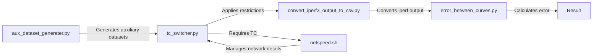

# Experiment Replication of Dynamic Network Conditions using Traffic Control (TC)

This repository contains code used to replicate network conditions from the [GENT dataset](https://users.ugent.be/~jvdrhoof/dataset-4g/), focusing on bandwidth and network restrictions using Traffic Control (TC) within a live network environment. The aim was to determine the optimal frequency for updating network restrictions without causing interference or anomalies in TC behavior. Different update windows (1, 5, 10, 15, 20, 25, and 30 seconds) were tested to assess dynamic network restriction application.

## Scripts

### aux_dataset_generater.py
- **Usage:** `python3 aux_dataset_generator.py <access.log> <bucket_size_seconds> <output.csv>`
- Generates discretized auxiliary datasets based on original datasets, intended as input for the script implementing dynamic network restrictions in TC.

### tc_switcher.py
- **Usage:** `sudo python3 tc_switcher.py <trace.csv> <target_interface> <max_seconds>`
- Applies bandwidth restrictions specified in a trace csv file to the target network interface. Optional argument defines the maximum execution time. Used alongside iperf for probing applied TC restrictions.

### convert_iperf3_output_to_csv.py
- **Usage:** `sudo python3 convert_iperf3_output_to_csv.py <iperf3.log>`
- Converts iperf output to a csv file for easier processing.

### error_between_curves.py
- **Usage:** `python3 error_between_curves.py <file1.csv> <column_name> <file2.csv> <column_name> -g`
- Plots curves and calculates the area between them, used to visualize differences between expected and measured bandwidth restrictions during TC application.

### graph.py
- **Usage:** `python3 graph.py <file.csv> column_name`
- Generates standalone graphs based on specified CSV data.

### netspeed.sh
- **Usage:** `./netspeed.sh -l speed_limit -s`
- A bash script sourced from the internet, managing low-level details necessary for applying and updating bandwidth restrictions using TC. With the `-s` option, clears previously applied restrictions.

### autom.sh
- **Usage:** `./autom.sh`
- Automates the process of passing different transportation trace files through the workflow of scripts outlined above.

**Script Relationship Diagram**

## Results Presentation

The results are summarized through graphs and tables showcasing the study's conclusions:
The quantitative metric to measure the quality of each update window size is the area between the expected and the measured bandwidth constraints. So, lower is better.
All the graphs containing the plot of expected and measured curves, as well as the calculated difference area can be found in the curves_differences folder.
In the table below are summarized the errors for each update window size and type of transportation of the traces:

|  transport\window size(seconds)       | 5               | 10              | 15              | 20              | 25              | 30              | sum             | sum/100k         |
|---------|-----------------|-----------------|-----------------|-----------------|-----------------|-----------------|-----------------|------------------|
| bicycle | 245821937.1     | 222794746.7     | 212359896.6     | 170483613.7     | 158574212.7     | 167558016.8     | 1177592424      | 11775.92424      |
| bus     | 290167187       | 221426230.8     | 185791798.6     | 158219437.9     | 154482211.2     | 116871774.4     | 1126958640      | 11269.5864       |
| car     | 338798953.3     | 209546128.3     | 202881152.6     | 177948251.3     | 168801452.8     | 170117711.4     | 1268093650      | 12680.9365       |
| foot    | 211284754.9     | 172848389.6     | 160188403.8     | 164209395.8     | 163994874.1     | 159770294.6     | 1032296113      | 10322.96113      |
| train   | 309037817.5     | 224185747.2     | 167436172.4     | 129558868.6     | 159627530       | 154011762.4     | 1143857898      | 11438.57898      |
| tram    | 211332731.5     | 313293663.5     | 279820874.6     | 269438575.6     | 240888917.2     | 203805227.7     | 1518579990      | 15185.7999       |
| sum     | 1606443381      | 1364094906      | 1208478299      | 1069858143      | 1046369198      | 972134787.4     |                 |                  |
| sum/100k| 16064.43381     | 13640.94906     | 12084.78299     | 10698.58143     | 10463.69198     | 9721.347874     |                 |                  |

The sums were divided by 100k to facilitate reading of the numbers.

